# Nexus

<p align="center">
  
</p>

<p align="center">
  <b>A calm, focused Android workspace for project planning and habit tracking.</b>
</p>

<p align="center">
  <a href="https://github.com/jBlack-MC/Nexus-app/actions/workflows/android-ci.yml">
    
  </a>
  
  
  
  
  
</p>

<p align="center">
  <a href="https://github.com/jBlack-MC/Nexus-app/actions/workflows/android-ci.yml">
    
  </a>
</p>

---

## 🏷️ Topic Tags

`#android` `#kotlin` `#jetpack-compose` `#material3` `#mvvm` `#room-database` `#retrofit` `#coroutines` `#stateflow` `#jwt-auth` `#habit-tracker` `#offline-first` `#gradle`

---

Nexus brings projects, tasks, and habit streaks into one clean, responsive mobile experience. Designed as a dependable daily planning companion, Nexus surfaces what matters now, helps you decide on clear next steps, and keeps you moving forward seamlessly—whether online or offline.

---

## 👥 Team

| Student Number | Name | Role |
| --- | --- | --- |
| **ST10438928** | Clarity Masuku | Backend/API Integration Android App Developer / UI & Authentication |
| **ST10462532** | Sibusiso Mabena | Testing & Quality Assurance |

> **Status**: Active Development. Default backend service is reachable at `http://10.0.2.2:5263/api/` when running on the Android Emulator.

---

## 📋 Contents

- [Topic Tags](#-topic-tags)
- [Features](#-features)
- [Splash Animation](#-splash-animation)
- [Product Direction](#-product-direction)
- [Roadmap](#-roadmap)
- [Tech Stack](#-tech-stack)
- [Key Design Decisions](#-key-design-decisions)
- [Requirements](#-requirements)
- [Getting Started](#-getting-started)
- [Test Credentials](#-test-credentials)
- [Build and Test](#-build-and-test)
- [Continuous Integration](#-continuous-integration)
- [Backend API Reference](#-backend-api-reference)
- [Part 2 PoE Evidence](#-part-2-poe-evidence)
- [Project Structure](#-project-structure)
- [Security and Release Notes](#-security-and-release-notes)
- [Contributing](#-contributing)
- [License](#-license)

---

## ✨ Features

- 🔐 **Secure Authentication**: Register and sign in with persisted JWT sessions (encrypted via AndroidX Security Crypto).
- 📊 **Interactive Dashboard**: Real-time project, task, habit streak, and activity counts.
- 📁 **Project Management**: Create, edit, inspect, and delete projects with progress tracking.
- ✅ **Task & Checklist Management**: Schedule tasks with due dates, priority levels, statuses, labels, and subtask checklists.
- 🔥 **Habits & Gamification**: Local domain scoring engine calculates current/best streaks, completion rates, points, levels, and unlockable badges.
- 🌐 **Multi-Language Support**: Localization for English (`en`), isiZulu (`zu`), and Setswana (`tn`) with MyMemory translation fallback.
- 💾 **Offline-First Caching**: Local Room database caches dashboards, projects, tasks, and habits when the network is unreachable.
- 📄 **Data Export**: Export habit history to CSV directly from Settings.
- 🎨 **Modern Material 3 UI**: Dynamic color support on Android 12+, dark/light theme options, and smooth motion transitions.

---

## 🎬 Splash Animation

The animated splash screen preview lives in [`docs/nexus-intro.svg`](docs/nexus-intro.svg). It recreates the Nexus logo resolution: a spinning loader resolving into connected nodes, forming the monogram and wordmark. The native implementation in [`SplashIntroScreen.kt`](app/src/main/java/com/example/nexus/ui/splash/SplashIntroScreen.kt) respects the system's "Reduce Motion" accessibility setting.

---

## 🎯 Product Direction

Nexus aims to be a zero-friction daily workspace.

| Principle | Meaning in Nexus |
| --- | --- |
| **Focus over clutter** | The home dashboard highlights overdue, due today, and upcoming priority items. |
| **Fast capture** | Adding a task or logging a habit takes seconds with smart defaults. |
| **Progress with context** | Visual progress indicators show what's moving, blocked, or completed. |
| **Calm by default** | Minimalist UI, smooth transitions, and clear empty states prevent pressure. |
| **Trustworthy data** | Session persistence and local Room fallback guarantee data stability. |

---

## 🛠️ Tech Stack

| Layer | Technology | Details |
| --- | --- | --- |
| **Language** | Kotlin `2.0.21` | Modern, idiomatic Kotlin code with strict type safety |
| **UI Framework** | Jetpack Compose & Material 3 | Single-activity declarative UI architecture |
| **Architecture** | MVVM + Clean Domain | `ViewModel`, `StateFlow`, pure domain logic (`HabitScoring`) |
| **Navigation** | Navigation Compose `2.8.0` | Type-safe navigation using `kotlinx.serialization` routes |
| **Networking** | Retrofit `3.0.0` + OkHttp `4.12.0` | REST API client with bearer token authorization & logging |
| **Session Security** | AndroidX Security Crypto `1.1.0` | EncryptedSharedPreferences for JWT token storage |
| **Local Database** | Room DB `2.8.5` | Local persistence and cache layer for offline reads/writes |
| **Backend API** | Node.js + Express REST API | Express server with Zod schema validation & Pino logging |
| **Build System** | Gradle `9.7.1` + AGP `9.3.1` | Kotlin DSL scripts with KtLint, Detekt, and Kover code coverage |
| **SDK Compatibility** | Min SDK `24` / Target & Compile SDK `37` | Wide device support (Android 7.0+) |

---

## 📐 Key Design Decisions

1. **Offline-Aware Reads & Habit Engine**: Dashboard, project, task, and habit reads are served from a Room cache when offline. The habit scoring system computes points, levels, and streaks on-device.
2. **Custom Node.js REST Backend**: Operates a lightweight Node.js + Express REST service using Zod request validation, Pino structured logging, and atomic file persistence (`.tmp` + `rename()`).
3. **JWT Authentication & Security**: Password hashes use salted digests. JWT tokens are stored securely in `EncryptedSharedPreferences` and attached to outgoing Retrofit requests via an interceptor.
4. **Code Quality & Linting Integration**: Configured with `ktlint` and `detekt` static analysis plugins to maintain clean code standards across all Kotlin source sets.

---

## ⚡ Requirements

- **Android Studio**: Ladybug / 2024.2+ with Android SDK Platform 37.
- **JDK**: Java 17 or higher.
- **Device/Emulator**: Running Android API 24 (Android 7.0) or higher.
- **Backend**: Node.js REST API running locally at `10.0.2.2:5263` (for emulator).

---

## 🚀 Getting Started

1. **Clone the Repository**:
   ```sh
   git clone https://github.com/jBlack-MC/Nexus-app.git
   cd Nexus-app
   ```
2. **Start the Local Backend**:
   ```sh
   cd backend
   npm install
   $env:JWT_SECRET = "a-long-random-secret-key-at-least-32-chars"
   npm start
   ```
3. **Open in Android Studio**:
   - Allow Gradle sync to download dependencies.
   - Select an emulator or connected device (API 24+).
   - Press **Run 'app'**.

---

## 🔑 Test Credentials

Run [`docs/seed_test_users.ps1`](docs/seed_test_users.ps1) while the backend is active to seed test accounts:

| Name | Email | Password | Role / Purpose |
| --- | --- | --- | --- |
| **Nexus Admin** | `admin@nexus-app.com` | `nexusAdmin123` | Global system administrator |
| **Jane Doe** | `jane.doe@nexus-app.com` | `janeDoe789` | Power user with active projects |
| **Test User** | `test.user@nexus-app.com` | `testUser456` | Standard user for testing |

---

## 🧪 Build and Test

Run standard Gradle tasks from the project root:

```sh
# Run Unit Tests
./gradlew test

# Build Debug APK
./gradlew assembleDebug

# Format and Lint Code
./gradlew ktlintFormat
./gradlew detekt
```

For Windows PowerShell:
```powershell
.\gradlew.bat test
.\gradlew.bat assembleDebug
```

---

## 📡 Backend API Reference

Base URL: `http://10.0.2.2:5263/api/`

| Method | Endpoint | Description |
| --- | --- | --- |
| `GET` | `/health` | Server liveness & uptime check |
| `POST` | `/auth/register` | Register new user account |
| `POST` | `/auth/login` | Authenticate and obtain JWT token |
| `GET`, `PATCH` | `/users/me` | Fetch or update profile / language / notification settings |
| `POST` | `/users/me/password` | Change user password |
| `DELETE` | `/users/me` | Delete account and associated data |
| `GET` | `/app/config` | Feature flags and app announcements |
| `GET`, `POST` | `/projects` | Fetch list or create a new project |
| `GET`, `PUT`, `DELETE` | `/projects/{id}` | Read, update, or delete a project |
| `GET`, `POST` | `/projects/{id}/tasks` | Fetch or create project tasks |
| `PUT`, `DELETE` | `/tasks/{id}` | Update or delete a task |
| `GET`, `POST` | `/habits` | List or create habits |
| `PATCH`, `DELETE` | `/habits/{id}` | Update habit streak or delete habit |

---

## 📂 Project Structure

```text
Nexus/
├── app/
│   ├── build.gradle.kts       # App-level build logic & dependencies
│   └── src/main/java/com/example/nexus/
│       ├── api/               # Retrofit interfaces, DTOs, & Network Interceptors
│       ├── auth/              # JWT session management & EncryptedSharedPreferences
│       ├── data/              # Room Database, DAOs, & Repositories
│       ├── domain/            # Pure Kotlin domain logic (HabitScoring)
│       ├── settings/          # Local key-value preference stores
│       ├── ui/                # Feature-based Compose UI & ViewModels
│       │   ├── auth/          # Login & Registration screens
│       │   ├── components/    # Reusable UI components (Logo, Skeleton, Feedback)
│       │   ├── dashboard/     # Home Dashboard screen
│       │   ├── habits/        # Habit tracker & gamification screens
│       │   ├── navigation/    # Navigation Compose host & routes
│       │   ├── profile/       # User profile screen
│       │   ├── projects/      # Project list & detail views
│       │   ├── settings/      # App settings & localization controls
│       │   ├── splash/        # Animated intro screen
│       │   ├── tasks/         # Task lists, task detail, & editor dialogs
│       │   └── theme/         # Material 3 typography, color schemes, & theme
│       └── NexusApp.kt        # Application class & DI Container
├── backend/                   # Node.js + Express REST API
├── docs/                      # Screenshots, scripts, & media assets
├── gradle/                    # Gradle wrapper & version catalog
├── build.gradle.kts           # Root build configuration
└── README.md                  # Project documentation
```

---

## 📄 License

All rights reserved by project authors. See repository details for updates.
